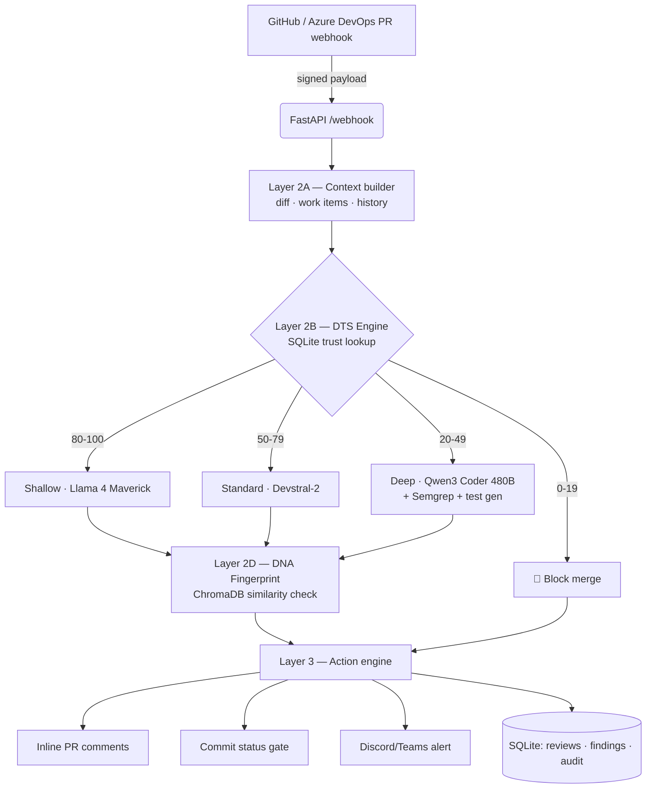

# 🛡️ DevGuardian

**AI-Powered Intelligent CI/CD Guardian for Azure DevOps / GitHub**
*Microsoft Hackathon — Theme 06: Production Function · Total cost: ₹0*

Most teams build *PR → AI review → suggestions*. DevGuardian is different: it is a **stateful quality gate** that learns **who** is submitting code and **what your codebase normally looks like**, then adapts how aggressively it reviews each pull request.

## The two core innovations

### 1. Developer Trust Score (DTS)
A 0–100 trust signal recalculated weekly from five explainable signals (bug introduction rate, revert rate, test-coverage delta, security findings, first-pass accept rate). **Never shown to managers** — it is consumed only by the AI pipeline to route review depth:

| DTS | Depth | Model (NVIDIA NIM, free tier) | Behaviour |
|---|---|---|---|
| 80–100 | Shallow | `meta/llama-4-maverick` | Quick scan, ~8 s |
| 50–79 | Standard | `mistralai/devstral-2-123b` | Full review, ~25 s |
| 20–49 | Deep | `qwen/qwen3-coder-480b-instruct` | Security audit + test generation, ~45 s |
| 0–19 | **Block** | no AI call | Merge blocked, team lead notified |

Formula (every score ships with a factor-by-factor breakdown — no black boxes):

```
DTS = 70 − bug_rate×20 − revert_rate×15 + coverage_delta×0.3 − security_count×10 + accept_rate×5
DTS = clamp(DTS, 0, 100)
```

### 2. Codebase DNA Fingerprint
Six months of merged code is embedded into **ChromaDB** (`nvidia/nv-embedqa-e5-v5`). New PR code is compared against **your team's actual history** — naming conventions, error-handling style, logging practice, type-hint usage — not generic lint rules. Output: *"This code is only 41% similar to anything in your codebase history."*

## The 6 modules

| # | Module | File | Free tooling |
|---|---|---|---|
| 1 | DTS Engine | `dts_engine.py` | Python + SQLite |
| 2 | DNA Fingerprint | `dna_engine.py` | NIM embeddings + ChromaDB |
| 3 | Security Scanner | `security_scanner.py` | Semgrep OSS (+ built-in OWASP rule pack on Windows) |
| 4 | Test Gap Detector | `test_generator.py` | Python AST + Qwen3 Coder |
| 5 | Team Risk Intelligence | `risk_reporter.py` | Llama 4 + Discord webhook |
| 6 | Deployment Risk Gate | `deploy_gate.py` | Trust aggregation → 🟢/🟡/🔴 |

## Quick start (zero keys needed)

```bash
pip install -r requirements.txt
python -m app.seeder             # 4 demo developers + 13 weeks of DTS history
uvicorn app.main:app --reload    # http://localhost:8000/dashboard
```

Every integration auto-degrades to **mock mode** when its key is missing, so the full pipeline — trust routing, review, DNA check, security scan, test generation, deploy gate — is demo-able completely offline. Add real keys later by copying `.env.example` → `.env`.

Try the pipeline from the dashboard (**Live PR Review** tab) or via API:

```bash
curl -X POST "http://localhost:8000/api/dna/ingest"
curl -X POST "http://localhost:8000/api/demo/simulate?persona=yogeshgurjar119&scenario=buggy"  # deep
curl -X POST "http://localhost:8000/api/demo/simulate?persona=muskan-3210&scenario=clean"      # shallow
curl       "http://localhost:8000/api/deploy-gate"
```

> Seeded personas: `muskan-3210` (shallow), `alex-rivera` (standard), `yogeshgurjar119` (deep), `sam-iqbal` (block). The usernames match real GitHub logins so live PR authors resolve to the intended trust band; rename them in `app/seeder.py` for your own accounts.

## Project structure

```
devguardian/
├── app/                      # application package (all Python source)
│   ├── main.py               # FastAPI orchestrator + REST API + webhook
│   ├── config.py             # env + mock-mode flags + model routing
│   ├── database.py           # SQLite schema + connection helper
│   ├── dts_engine.py         # Developer Trust Score + depth routing
│   ├── nim_client.py         # NVIDIA NIM client (adaptive review, retries)
│   ├── dna_engine.py         # Codebase DNA — ChromaDB + trait extraction
│   ├── security_scanner.py   # Semgrep / built-in OWASP rule pack
│   ├── test_generator.py     # AST test-gap detection + AI test generation
│   ├── github_adapter.py     # webhook verify · diff · comments · status
│   ├── notifier.py           # Discord / Teams alerts
│   ├── risk_reporter.py      # weekly anonymised team risk report
│   ├── deploy_gate.py        # Red/Yellow/Green release gate
│   └── seeder.py             # demo data (run: python -m app.seeder)
├── static/index.html         # Tailwind SPA dashboard
├── demo_fixtures/            # sample diffs + commit history for DNA
├── tests/                    # pytest suite (28 tests)
├── docs/                     # architecture.png · user_flow.png · guides
├── Dockerfile · docker-compose.yml · entrypoint.sh
├── .github/workflows/ci.yml · azure-pipelines.yml
└── requirements.txt · .env.example
```

Run: `python -m app.seeder` then `uvicorn app.main:app --reload`.
Tests / local Semgrep: `pip install -r requirements-dev.txt && pytest -q`.

## Architecture (3 layers)



## Live demo with real integrations

1. `cp .env.example .env`, fill `NVIDIA_API_KEY` (free at build.nvidia.com), GitHub PATs, Discord webhook URL.
2. `ngrok http 8000` → paste the URL into your repo's webhook settings (secret = `GITHUB_WEBHOOK_SECRET`).
3. Open a PR — inline comments appear on the buggy lines within ~45 s and a Discord alert fires.

## Run with Docker

```bash
docker compose up --build       # dashboard on http://localhost:8000
```

## Tests

```bash
pytest -v                        # 28 tests: DTS formula, routing, scanner, webhook E2E
```

## Documentation

- [docs/ARCHITECTURE.md](docs/ARCHITECTURE.md) — diagrams, data flow, DB schema
- [docs/API.md](docs/API.md) — REST endpoints (Swagger at `/docs`)
- [docs/DEPLOYMENT.md](docs/DEPLOYMENT.md) — local, ngrok, Docker, Railway
- [docs/DEMO_SCRIPT.md](docs/DEMO_SCRIPT.md) — 5-min and 10-min demo scripts
- [docs/JUDGE_QA.md](docs/JUDGE_QA.md) — expected judge questions + answers
- [docs/HACKATHON_SUBMISSION.md](docs/HACKATHON_SUBMISSION.md) — submission document & pitch

## Ethics & governance

- DTS is **pipeline-internal only** — never exposed to managers, never a performance metric.
- Every score and risk verdict carries an explainable breakdown.
- Team reports are anonymised at source; individuals are never named.
- Full audit log of every automated action (`/api/audit`).
