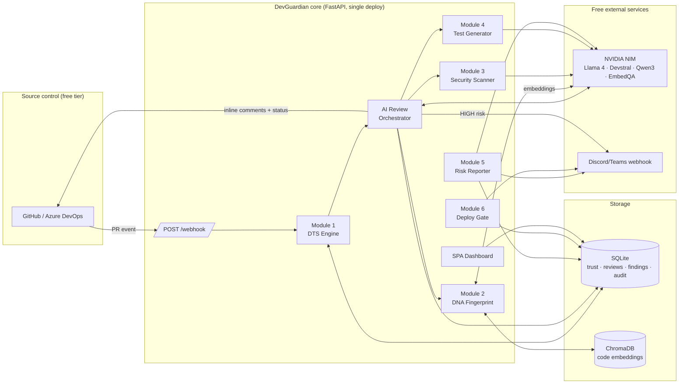
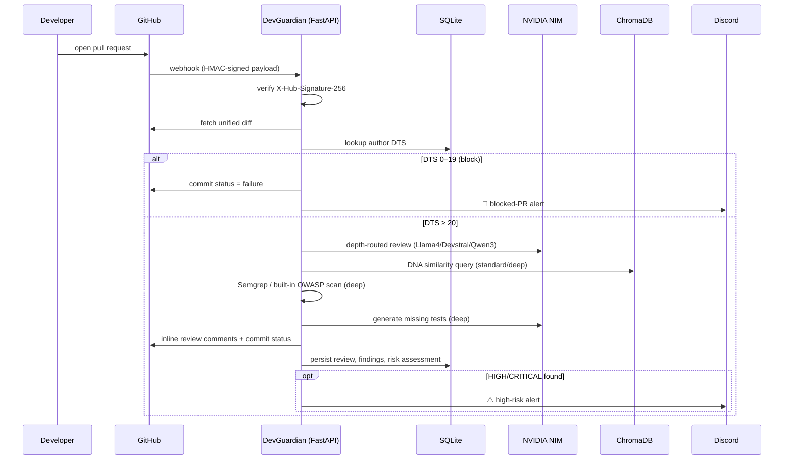
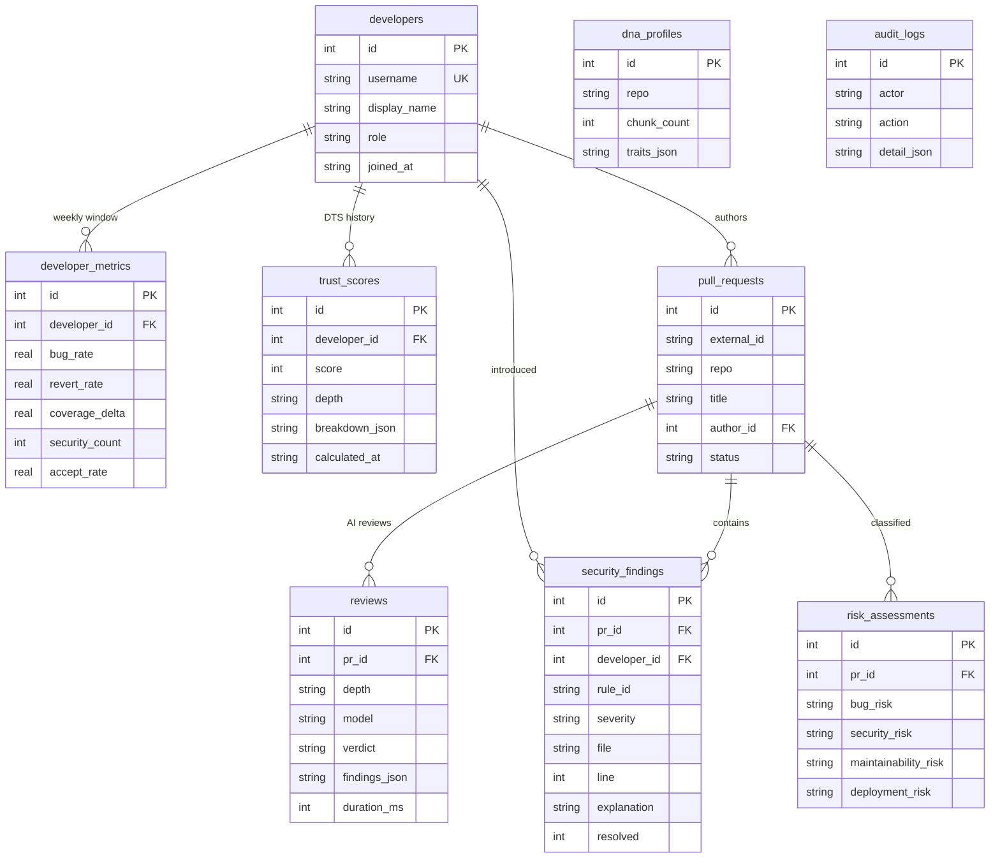
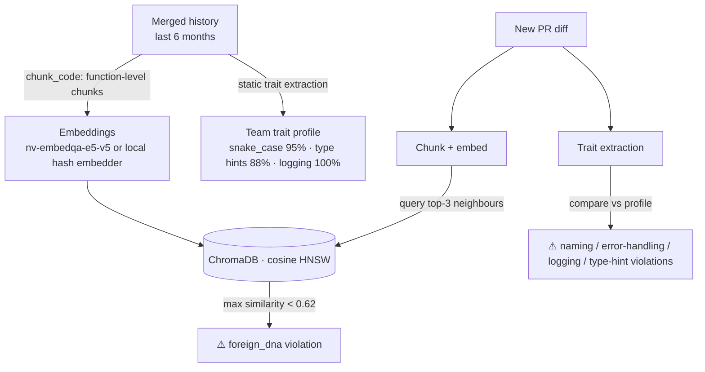

# DevGuardian — Architecture

## 1. High-level architecture

## 2. PR review sequence

## 3. Entity-relationship diagram

Indexes: `idx_metrics_dev`, `idx_trust_dev`, `idx_pr_author`, `idx_findings_dev` — all hot paths (latest score per developer, findings per window) are index-backed. SQLite runs in WAL mode so webhook handling and background jobs share the database safely.

## 4. Component responsibilities

| Component | Responsibility | Key decision |
|---|---|---|
| `config.py` | env + model routing + auto mock flags | Missing key ⇒ that integration mocks itself; pipeline never breaks |
| `dts_engine.py` | trust formula, depth routing, history | Explainable breakdown stored with every score |
| `nim_client.py` | NIM calls, 429 fallback to Nemotron | OpenAI SDK against `integrate.api.nvidia.com` |
| `dna_engine.py` | embeddings + trait extraction | Two layers: semantic similarity *and* measurable traits, so every violation is explainable |
| `security_scanner.py` | Semgrep subprocess, OWASP fallback pack | Scans only **added** lines reconstructed from the diff |
| `test_generator.py` | AST gap detection → AI tests | Only public functions without test references count as gaps |
| `risk_reporter.py` | weekly anonymised aggregation | Individuals never named; cohort-level signals only |
| `deploy_gate.py` | release gate | RED on any DTS<20 author or unresolved CRITICAL |
| `main.py` | orchestrator + REST + SPA | Webhook returns 200 immediately; review runs as background task |

## 5. Data flow — DNA fingerprint

## 6. Security model

- Webhook HMAC-SHA256 signature verification (constant-time compare).
- Secrets only via `.env` (git-ignored); `.env.example` documents every variable.
- Diff content capped at 60 KB before model calls; SQL access is parameterised throughout.
- Every automated action is written to `audit_logs`.
- DevGuardian scans itself: CI runs Semgrep over the repo on every push.
